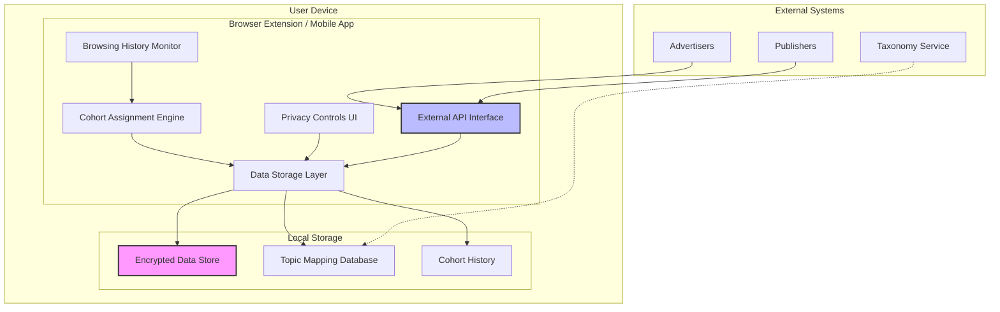

# Design Document

## Overview

The Local Privacy Cohort Tracker is a privacy-first system that implements cohort-based interest tracking entirely on the user's device. The system replaces third-party cookies with a local processing approach inspired by Google's Privacy Sandbox APIs, specifically the Topics API, FLEDGE, and Attribution Reporting API. The architecture ensures that individual user data never leaves the device while still enabling relevant advertising and content delivery through anonymized cohort assignments.

The system operates across multiple platforms (browser extensions and mobile apps) and provides secure APIs for advertisers and publishers to access aggregated cohort data without compromising user privacy.

## Architecture

### High-Level Architecture



### Component Architecture

The system follows a modular architecture with clear separation of concerns:

1. **Data Collection Layer**: Monitors browsing activity and captures domain visits
2. **Processing Layer**: Analyzes domains and assigns cohorts based on topic taxonomy
3. **Storage Layer**: Securely stores cohort data with encryption and access controls
4. **API Layer**: Provides secure interfaces for external systems
5. **UI Layer**: Offers user controls for privacy management

## Components and Interfaces

### 1. Browsing History Monitor

**Purpose**: Captures and preprocesses browsing activity for cohort assignment.

**Key Interfaces**:
```typescript
interface BrowsingHistoryMonitor {
  onPageVisit(url: string, timestamp: Date): void;
  getDomainVisits(timeRange: TimeRange): DomainVisit[];
  startMonitoring(): void;
  stopMonitoring(): void;
}

interface DomainVisit {
  domain: string;
  timestamp: Date;
  visitCount: number;
}
```

**Implementation Details**:
- Browser Extension: Uses `chrome.tabs.onUpdated` and `webNavigation` APIs
- Mobile App: Integrates with system browser history APIs (with permissions)
- Filters out sensitive domains (banking, healthcare, etc.)
- Implements rate limiting to prevent excessive processing

### 2. Cohort Assignment Engine

**Purpose**: Analyzes domain visits and assigns users to interest-based cohorts.

**Key Interfaces**:
```typescript
interface CohortAssignmentEngine {
  assignCohorts(domainVisits: DomainVisit[]): CohortAssignment[];
  updateWeeklyCohorts(): void;
  getCohortTaxonomy(): TopicTaxonomy;
}

interface CohortAssignment {
  topicId: number;
  topicName: string;
  confidence: number;
  assignedDate: Date;
  expiryDate: Date;
}

interface TopicTaxonomy {
  topics: Topic[];
  domainMappings: Map<string, number[]>;
}
```

**Algorithm Design**:
1. **Domain Classification**: Maps visited domains to topic IDs using predefined taxonomy
2. **Frequency Analysis**: Calculates visit frequency and recency for each topic
3. **Cohort Selection**: Selects top 5 topics based on weighted scoring algorithm
4. **Privacy Filtering**: Excludes sensitive categories and applies differential privacy techniques
5. **Temporal Management**: Implements 3-week rolling window with weekly updates

### 3. Data Storage Layer

**Purpose**: Provides secure, encrypted storage for all cohort-related data.

**Key Interfaces**:
```typescript
interface DataStorageLayer {
  storeCohortData(cohorts: CohortAssignment[]): Promise<void>;
  getCohortData(): Promise<CohortAssignment[]>;
  storeUserPreferences(prefs: UserPreferences): Promise<void>;
  getUserPreferences(): Promise<UserPreferences>;
  clearExpiredData(): Promise<void>;
  encryptData(data: any): string;
  decryptData(encryptedData: string): any;
}

interface UserPreferences {
  cohortsEnabled: boolean;
  disabledTopics: number[];
  dataRetentionDays: number;
  shareWithAdvertisers: boolean;
}
```

**Storage Implementation**:
- **Browser Extensions**: Uses `chrome.storage.local` with AES-256 encryption
- **Mobile Apps**: 
  - Android: EncryptedSharedPreferences with Android Keystore
  - iOS: Keychain Services with hardware security module
- **Data Isolation**: Each cohort assignment stored separately with access controls
- **Automatic Cleanup**: Background service removes expired data

### 4. Privacy Controls UI

**Purpose**: Provides transparent user interface for managing cohort assignments and privacy settings.

**Key Interfaces**:
```typescript
interface PrivacyControlsUI {
  displayCurrentCohorts(): CohortDisplayData[];
  toggleCohortStatus(topicId: number, enabled: boolean): void;
  exportUserData(): UserDataExport;
  deleteAllData(): void;
  showDataUsageExplanation(): void;
}

interface CohortDisplayData {
  topicName: string;
  description: string;
  isActive: boolean;
  assignedDate: Date;
  expiryDate: Date;
  canDisable: boolean;
}
```

**UI Components**:
- **Dashboard**: Overview of active cohorts with explanations
- **Topic Management**: Individual controls for each cohort assignment
- **Privacy Settings**: Global controls for data sharing and retention
- **Data Export**: GDPR-compliant data export functionality
- **Help System**: Contextual explanations of cohort usage

### 5. External API Interface

**Purpose**: Provides secure, privacy-preserving APIs for advertisers and publishers.

**Key Interfaces**:
```typescript
interface ExternalAPIInterface {
  getCohortIds(requestContext: APIRequestContext): Promise<string[]>;
  getAggregatedMetrics(cohortIds: string[], timeRange: TimeRange): Promise<MetricsData>;
  validateAPIKey(apiKey: string): Promise<boolean>;
}

interface APIRequestContext {
  domain: string;
  apiKey: string;
  requestType: 'advertising' | 'measurement';
  timestamp: Date;
}

interface MetricsData {
  cohortId: string;
  impressions: number;
  clicks: number;
  conversions: number;
  aggregationLevel: 'high' | 'medium' | 'low';
}
```

**Security Features**:
- **Authentication**: API key-based authentication with rate limiting
- **Authorization**: Domain-based access controls
- **Data Minimization**: Returns only necessary cohort IDs (max 3 per request)
- **Aggregation**: Ensures minimum threshold for metric reporting
- **Audit Logging**: Tracks all API access for compliance

## Data Models

### Core Data Structures

```typescript
// Topic Taxonomy Model
interface Topic {
  id: number;
  name: string;
  parentId?: number;
  level: number;
  isSensitive: boolean;
  description: string;
}

// Domain Mapping Model
interface DomainMapping {
  domain: string;
  topicIds: number[];
  confidence: number;
  lastUpdated: Date;
  source: 'manual' | 'ml' | 'keyword';
}

// User Cohort Profile
interface UserCohortProfile {
  userId: string; // Local device identifier
  activeCohorts: CohortAssignment[];
  preferences: UserPreferences;
  lastUpdated: Date;
  version: string;
}

// API Request Log
interface APIRequestLog {
  requestId: string;
  domain: string;
  timestamp: Date;
  cohortsShared: string[];
  requestType: string;
  userConsent: boolean;
}
```

### Database Schema

**Local Storage Structure**:
```
encrypted_cohort_data/
├── user_profile.enc          # User cohort profile
├── domain_mappings.enc       # Domain to topic mappings
├── api_logs/                 # API request logs
│   ├── 2025-01-*.enc
│   └── 2025-02-*.enc
└── preferences.enc           # User privacy preferences
```

## Error Handling

### Error Categories and Responses

1. **Storage Errors**:
   - Encryption/Decryption failures → Fallback to unencrypted temporary storage
   - Storage quota exceeded → Automatic cleanup of oldest data
   - Corruption detected → Reset to default state with user notification

2. **Processing Errors**:
   - Invalid domain format → Skip domain and log warning
   - Taxonomy lookup failure → Use fallback keyword matching
   - Cohort assignment failure → Maintain previous assignments

3. **API Errors**:
   - Authentication failure → Return 401 with retry instructions
   - Rate limiting exceeded → Return 429 with backoff timing
   - Invalid request format → Return 400 with detailed error message

4. **Privacy Errors**:
   - Consent withdrawal → Immediate data deletion and API blocking
   - Sensitive category detection → Automatic exclusion from processing
   - Data retention violation → Automatic cleanup and audit log

### Error Recovery Strategies

```typescript
interface ErrorHandler {
  handleStorageError(error: StorageError): RecoveryAction;
  handleProcessingError(error: ProcessingError): RecoveryAction;
  handleAPIError(error: APIError): APIResponse;
  handlePrivacyError(error: PrivacyError): PrivacyAction;
}

enum RecoveryAction {
  RETRY_WITH_BACKOFF,
  FALLBACK_TO_DEFAULT,
  RESET_COMPONENT,
  NOTIFY_USER,
  LOG_AND_CONTINUE
}
```

## Testing Strategy

### Unit Testing

**Coverage Areas**:
- Cohort assignment algorithm accuracy
- Encryption/decryption functionality
- API request/response handling
- Privacy control logic
- Data retention and cleanup

**Testing Framework**:
- Browser Extensions: Jest with WebExtensions API mocks
- Mobile Apps: Platform-specific testing frameworks (Espresso/XCTest)
- Shared Logic: TypeScript with comprehensive test suites

### Integration Testing

**Test Scenarios**:
1. **End-to-End Cohort Assignment**: Simulate browsing → cohort assignment → API access
2. **Cross-Platform Consistency**: Verify identical behavior across all platforms
3. **Privacy Compliance**: Validate no individual data exposure
4. **Performance Impact**: Measure resource usage under various loads
5. **Security Validation**: Penetration testing of encryption and API security

### Privacy Testing

**Validation Methods**:
- **Data Flow Analysis**: Verify no individual data leaves the device
- **Differential Privacy Testing**: Validate privacy guarantees in cohort assignments
- **Consent Flow Testing**: Ensure proper handling of user consent changes
- **Compliance Testing**: Validate GDPR/CCPA requirement adherence

### Performance Testing

**Metrics and Targets**:
- **Memory Usage**: < 50MB for browser extension, < 100MB for mobile app
- **CPU Impact**: < 5% during active processing
- **Storage Growth**: < 10MB per month of typical usage
- **API Response Time**: < 200ms for cohort ID requests
- **Battery Impact**: < 1% additional drain on mobile devices

## Security Considerations

### Data Protection

1. **Encryption at Rest**: AES-256 encryption for all stored data
2. **Key Management**: Platform-specific secure key storage
3. **Data Isolation**: Sandboxed storage preventing cross-application access
4. **Secure Deletion**: Cryptographic erasure for data removal

### API Security

1. **Authentication**: API key-based with rotation capabilities
2. **Rate Limiting**: Prevents abuse and ensures fair usage
3. **Input Validation**: Comprehensive validation of all API inputs
4. **Audit Logging**: Complete audit trail for compliance

### Privacy Safeguards

1. **Differential Privacy**: Noise injection in cohort assignments
2. **K-Anonymity**: Minimum group sizes for metric reporting
3. **Data Minimization**: Only necessary data collection and sharing
4. **Consent Management**: Granular consent controls with easy withdrawal